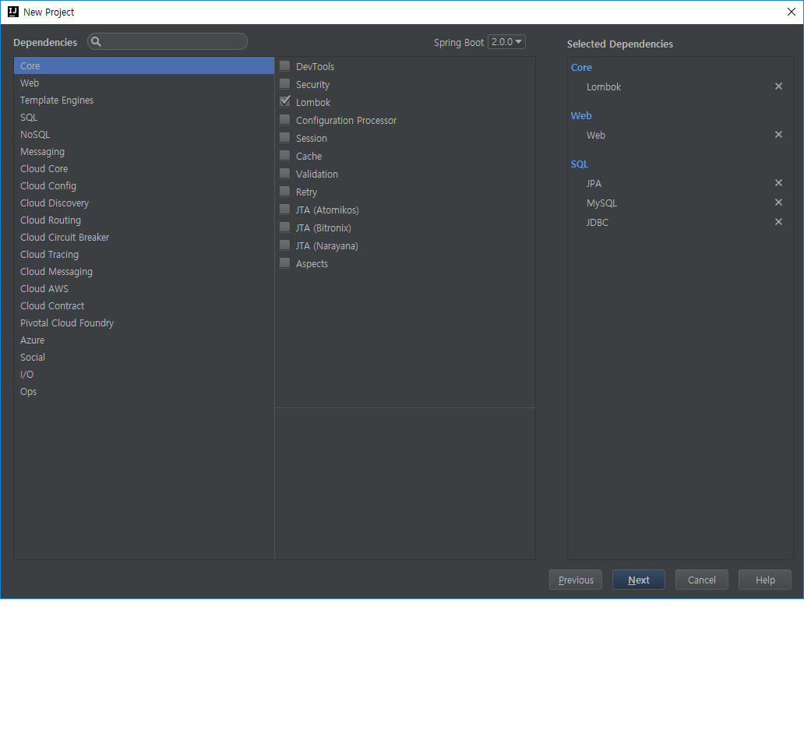

# jpa_demo
---

---

---

spring boot

maria db

spring-data-jpa

JPA entitis mapping test

- hibernate.hbm2ddl.auto
 1. create
 2. create-drop
 3. update
 4. none
 
- hibernate.dialect
 1. org.hibernate.dialect.MySQL5InnoDBDialect
 
 - org.hibernate.loader.MultipleBagFetchException
  1. FetchType.EAGER 가진 두 개의 콜렉션을 좋아하지 않는다.
  2. 위와 같은 예외가 발생하면, FetchType을 Lazy로 수정하자. (언제부터인가 검증을 하는거같은..)
  
  
